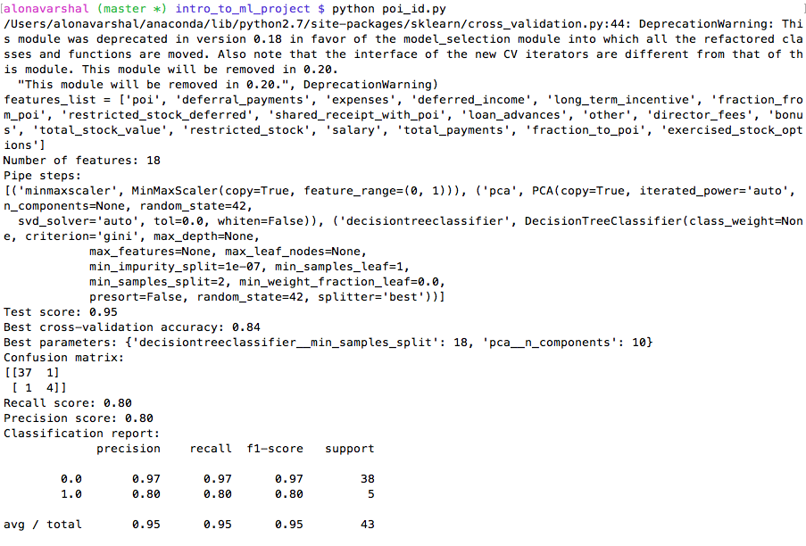

# Identification of Person-of-Interest in the Enron Scandal

This is a project for the Udacity Introduction to Machine Learning course. It involves using machine learning techniques to identify persons of interest in the Enron Scandal, which is a case about corporate fraud. For more information on the Enron Scandal, please click [here](https://en.wikipedia.org/wiki/Enron_scandal).

**Answers to questions for the project:**

***1. Summarize for us the goal of this project and how machine learning is useful in trying to accomplish it. As part of your answer, give some background on the dataset and how it can be used to answer the project question. Were there any outliers in the data when you got it, and how did you handle those?  [relevant rubric items: “data exploration”, “outlier investigation”]***

The goal of the project is to construct a classifier that can predict whether someone is a person of interest in the Enron corporate fraud. A classifier is an algorithm that has statistically incorporated behaviors from data obtained in the past. In layman's terms, an algorithm is a mathematical formula derived from data already available. It predicts an outcome using the formula from another data set that the formula hasn't encountered before.

For the Enron corporate fraud case, data on various Enron employees' financial information as well as email information with information on who the persons of interest were are available and could be used to statistically come up with a formula or algorithm that could predict persons of interest in the same case. But before an algorithm can be extracted from the data available, the data need to be properly set up and be free from errors that can lead to a misleading algorithm. In the Enron email and financial data set, some items that need to be straightened up were the presence of datapoints (rows in the dataset table) that should not be there, such as "TOTAL" and "THE REGENCY AT THE PARK" which are obviously not persons. The datapoint "TOTAL" was determined by obtaining the scatterplot of features "salary" and "bonus". After the removal of this datapoint, the scatterplot does not show any more outliers.

***2. What features did you end up using in your POI identifier, and what selection process did you use to pick them? Did you have to do any scaling? Why or why not? As part of the assignment, you should attempt to engineer your own feature that does not come ready-made in the dataset -- explain what feature you tried to make, and the rationale behind it. (You do not necessarily have to use it in the final analysis, only engineer and test it.) In your feature selection step, if you used an algorithm like a decision tree, please also give the feature importances of the features that you use, and if you used an automated feature selection function like SelectKBest, please report the feature scores and reasons for your choice of parameter values.  [relevant rubric items: “create new features”, “properly scale features”, “intelligently select feature”]***

From the class, the calculation of fractions for emails sent to poi and emails obtained from poi was discussed, so I included them as new features in the analysis. After calculating the fractions resulting to new, derived features "fraction_to_poi" and "fraction_from_poi", the raw data used for calculation were then excluded, which left me with 18 features. Scaling for the Enron data is critical as discussed in the class--since the features have varying magnitudes: "fraction_from_poi" and "fraction_to_poi" would have values lower than 1, while "salary", "bonus", etc. are in the millions.

I decided to use principal component analysis (PCA) instead of SelectKBest to help with feature selection. PCA is dimensionality reduction tool that can incorporate information from original features into new derived features (which are called components). SelectKBest is a feature selection technique that chooses the best features according to k highest scores. Using PCA, I need not reduce the number of features I had after creating the fractions of emails I discussed above. I also did not use any other feature selection after PCA. My results with PCA were a lot better than those using SelectKBest. Using a GridSearchCV, I was able to select the optimal n_components from PCA to feed into the classifier:
```
pipe = make_pipeline(MinMaxScaler(), PCA(random_state=42), DecisionTreeClassifier(random_state=42))
param_grid = {'pca__n_components': [2, 3, 4, 5, 6, 7, 8, 9, 10], \
              'decisiontreeclassifier__min_samples_split': [2, 4, 6, 8, 10, 12, 14, 16, 18, 20]}
```
Using PCA allowed me to not do any more feature selection algorithm as PCA incorporates information from raw features into new "features" that are going to be eventually used in the classification. After PCA, I don't feel there is a need for another feature selection. The resulting components are already pretty low in variance, not surpassing 0.5 in explained variance ratio:

```
In [60]: grid.best_estimator_.named_steps["pca"].explained_variance_ratio_
Out[61]: array([ 0.33899221,  0.15391044,  0.11383137,  0.0934518 ,  0.07233598,
         	 0.05716161,  0.03749206,  0.03380555,  0.02702912,  0.0230194 ])
```

***3. What algorithm did you end up using? What other one(s) did you try? How did model performance differ between algorithms?  [relevant rubric item: “pick an algorithm”]***

I eventually used Decision Trees as classification algorithm after MinMaxScaler for feature scaling and PCA for dimensionality reduction. This classification algorithm gave me the highest precesion and recall. Other classification algorithms have lower accuracy, precision and recall scores. With this algorithm together with feature scaling and selection, I was able to obtain an accuracy of 95%, a precision score of 80% and recall score of 80%. Other classifiers didn't go close to these values. 



***4. What does it mean to tune the parameters of an algorithm, and what can happen if you don’t do this well?  How did you tune the parameters of your particular algorithm? (Some algorithms do not have parameters that you need to tune -- if this is the case for the one you picked, identify and briefly explain how you would have done it for the model that was not your final choice or a different model that does utilize parameter tuning, e.g. a decision tree classifier).  [relevant rubric item: “tune the algorithm”]***

Tuning the parameters for the classification involves determining the optimal parameters available for the particular algorithm that results in the highest metric scores. For example in the decision tree classifier I used, one parameter I played around with is min_samples_split. Using the GridSearchCV function, it is a lot easier to deploy tuning for the optimal parameters. The best estimator can be accessed using ".best_estimator_" attribute for the resulting object after deploying GridSearchCV.

***5. What is validation, and what’s a classic mistake you can make if you do it wrong? How did you validate your analysis?  [relevant rubric item: “validation strategy”]***

Validation is running a classifier on a test data. A classic mistake is to run a classifier that has been created out of a data set and using the same data set to test the classifier on. This is called overfitting. I did my validation using the train_test_split function in the cross_validation module (or model_selection in newer versions) in sklearn. This way, my training set is different from my test set as the train_test_split function divides the data set into training set and test set. Another cross-validation I employed was the StratifiedShuffleSplit during training of the training set. This function is often used in cases where there is a large imbalance in the distribution of target classes, such as in the Enron data set where there are only a few POIs and a very large number of non-POIs. 

***6. Give at least 2 evaluation metrics and your average performance for each of them.  Explain an interpretation of your metrics that says something human-understandable about your algorithm’s performance. [relevant rubric item: “usage of evaluation metrics”]***


