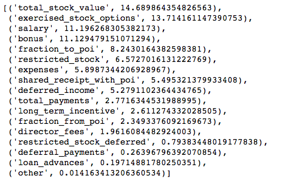
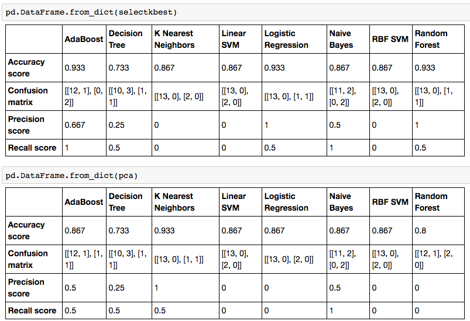
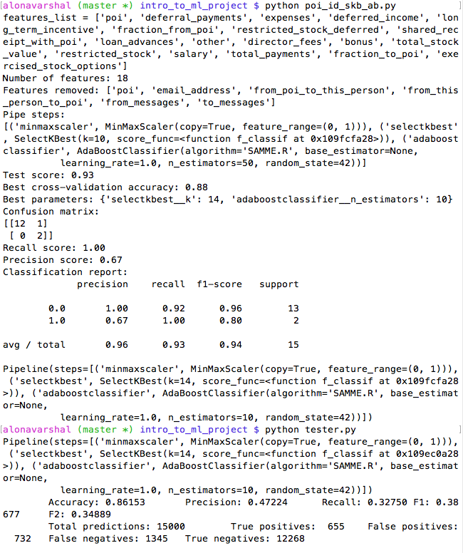

# Documentation of Work

This is a project for the Udacity Introduction to Machine Learning course. It involves using machine learning techniques to identify persons of interest in the Enron Scandal, which is a case about corporate fraud. For more information on the Enron Scandal, please click [here](https://en.wikipedia.org/wiki/Enron_scandal).

For full details on how I chose my algorithm, please see my [IPython notebook](https://github.com/mudspringhiker/enron_poi_id_machine_learning_project/blob/master/classifier_comparison.ipynb).

**Answers to questions for the project:**

***1. Summarize for us the goal of this project and how machine learning is useful in trying to accomplish it. As part of your answer, give some background on the dataset and how it can be used to answer the project question. Were there any outliers in the data when you got it, and how did you handle those?  [relevant rubric items: “data exploration”, “outlier investigation”]***

The goal of the project is to construct a classifier that can predict whether someone is a person of interest in the Enron corporate fraud. A classifier is an algorithm that has statistically incorporated behaviors from data obtained in the past. In layman's terms, an algorithm is a mathematical formula derived from data already available. It predicts an outcome using the formula from another data set that the formula hasn't encountered before.

For the Enron corporate fraud case, data on various Enron employees' financial information as well as email information with information on who the persons of interest were are available and could be used to statistically come up with a formula or algorithm that could predict persons of interest in the same case. But before an algorithm can be extracted from the data available, the data need to be properly set up and be free from errors that can lead to a misleading algorithm.

In the Enron email and financial data set provided in the course, some items need to be corrected. There are 146 data points (initially). There were 21 features. There are 18 POIs and the rest are non-POIs. Of the 146 data points, two data points need to be removed, which were "TOTAL" and "THE REGENCY AT THE PARK", are obviously not persons. The data point "TOTAL" was discussed in the class (revealed by plotting two features, "bonus" and "salary", showing an outlier, which is "TOTAL"). However, this could have been revealed by just looking at the data set perhaps in a spreadsheet form since the data isn't that big anyway. I explored the dataset using pandas, but I still can't see everything. Some errors cannot be easily detected. Three more data points were corrected. One of these was removed due to lack of data (all features were zero) and the other two had features that were mistakenly entered. These can be confirmed by making sure that "total_stock_value" is the sum of all stock features and that "total_payments" is the sum of all the other features. To examine this, I found it easier to look at the data using a spreadsheet, so I exported the data to csv, which I was able to view using Excel. After confirming which data points need to be corrected, I then manually corrected the values in the dictionary I used for the analysis. Also, there were many missing values (NaN) which were converted to 0.

***2. What features did you end up using in your POI identifier, and what selection process did you use to pick them? Did you have to do any scaling? Why or why not? As part of the assignment, you should attempt to engineer your own feature that does not come ready-made in the dataset -- explain what feature you tried to make, and the rationale behind it. (You do not necessarily have to use it in the final analysis, only engineer and test it.) In your feature selection step, if you used an algorithm like a decision tree, please also give the feature importances of the features that you use, and if you used an automated feature selection function like SelectKBest, please report the feature scores and reasons for your choice of parameter values.  [relevant rubric items: “create new features”, “properly scale features”, “intelligently select feature”]***

From the class, the calculation of fractions for emails sent to poi and emails obtained from poi was discussed, so I included them as new features in the analysis. After calculating the fractions resulting to new, derived features "fraction_to_poi" and "fraction_from_poi", the raw data used for calculation were then excluded (from_this_person_to_poi, from_poi_to_this_person, from_messages, to_messages). The feature email_address was also excluded, making a total of 18 features, including "poi" for the analysis. When the new features were not used (that is, just using the original features), metrics obtained were lower, so it is decided that the new features be used. The following were the metrics with and without the engineered features with the two best algorithms I was able to come up with.

|     Algorithm   |  Engineered Features   |   Accuracy    |   Precision   |   Recall  |
|-----------------|:----------------------:|:-------------:|:-------------:|----------:|
|   AdaBoost      |         no             |     0.856     |     0.404     |   0.156   |
|   AdaBoost      |         yes            |     0.861     |     0.472     |   0.323   |
|  Naive Bayes    |         no             |     0.835     |     0.349     |   0.274   |
|  Naive Bayes    |         yes            |     0.836     |     0.364     |   0.310   |


Scaling for the Enron data is critical as discussed in the class--since the features have varying magnitudes: "fraction_from_poi" and "fraction_to_poi" would have values lower than 1, while "salary", "bonus", etc. are in the millions. I used MinMaxScaler among the available feature scaling functions in sklearn.

For feature selection, I explored SelectKBest and principal component analysis (PCA). PCA is dimensionality reduction tool that can incorporate information from original features into new derived features (which are called components). SelectKBest is a feature selection technique that chooses the best features according to k highest scores. In the end, I chose SelectKBest. This was after obtaining all metric scores using MinMaxScaler, either SelectKBest or PCA and classifiers in a pipeline, so it came together with whatever classifier gave the highest metric scores. The feature importances are shown below:



(For details on how I obtained this, see [IPython notebook](https://github.com/mudspringhiker/enron_poi_id_machine_learning_project/blob/master/classifier_comparison.ipynb).

As to how many of these features were used in the final algorithm were the result of gridsearching through the k numbers of features for SelectKBest. The code for this is in [poi_id_skb_ab.py](https://github.com/mudspringhiker/enron_poi_id_machine_learning_project/blob/master/poi_id_skb_ab.py) or see code below, for answer to question no. 4. After running the code, it appears that the optimal k is 14 (see figure included in answer for question 6). (This can also be accessed by using the best_parameters_ attribute for the object created after fitting.)

***3. What algorithm did you end up using? What other one(s) did you try? How did model performance differ between algorithms?  [relevant rubric item: “pick an algorithm”]***

I eventually used AdaBoostClassifier. The following table shows the results of my preliminary exploration on various classifiers. The top shows metrics from using SelectKBest as feature selection and the bottom table shows metrics from using PCA.



These results were obtained by looping over the various classifiers I can possibly use as a beginner in machine learning. My [IPython notebook](https://github.com/mudspringhiker/enron_poi_id_machine_learning_project/blob/master/classifier_comparison.ipynb) shows the code for this. But from these results, I was able to see that the best classifiers are:

SelectKBest feature selection:
- AdaBoost
- Naive Bayes
- Logistic Regression
- Random Forest

PCA as feature selection:
- KNN
- Naive Bayes
- AdaBoost

I then tried to optimize these classifiers, using the method described below. But in the end, I chose AdaBoostClassifier, together with MinMaxScaler and SelectKBest, which gave me the highest scores using the tester.py program provided to measure the algorithm's accuracy, precision and recall.

***4. What does it mean to tune the parameters of an algorithm, and what can happen if you don’t do this well?  How did you tune the parameters of your particular algorithm? (Some algorithms do not have parameters that you need to tune -- if this is the case for the one you picked, identify and briefly explain how you would have done it for the model that was not your final choice or a different model that does utilize parameter tuning, e.g. a decision tree classifier).  [relevant rubric item: “tune the algorithm”]***

Tuning the parameters for the classification involves determining the optimal parameters available for the particular algorithm that results in the highest metric scores. In AdaBoostClassifier, there are various parameters that can be modified including base_estimator, n_estimators, learning_rate, algorith, and random_state. Using the GridSearchCV function, it is a lot easier to deploy tuning for the optimal parameters. The best estimator can be accessed using ".best_estimator_" attribute for the resulting object after deploying GridSearchCV. If the parameters are not tuned, underfitting or overfitting might occur.

For my AdaBoostClassifier optimization, I tinkered only with n_estimators and kept random_state fixed to make it produce the same result each time I run it. In the initial stages of my classifier exploration, the value of n_estimators used was the default, 50, since I did not specify its value. Running a gridsearch on this parameter allowed me to see that the scores can get better when n_estimators is decreased to 10.

```
from sklearn.pipeline import make_pipeline
from sklearn.preprocessing import MinMaxScaler
from sklearn.feature_selection import SelectKBest
from sklearn.model_selection import GridSearchCV
from sklearn.ensemble import AdaBoostClassifier

pipe = make_pipeline(MinMaxScaler(), SelectKBest(), AdaBoostClassifier(random_state=42))

# parameter grid for selectkbest and classifier:
param_grid = {'selectkbest__k': range(5,15), \
              'adaboostclassifier__n_estimators': [5, 10, 20, 30, 40, 50]}

# gridsearch and cross-validation:
grid = GridSearchCV(pipe, param_grid=param_grid, cv=5)

# fitting:
grid.fit(features_train, labels_train)
```

***5. What is validation, and what’s a classic mistake you can make if you do it wrong? How did you validate your analysis?  [relevant rubric item: “validation strategy”]***

Validation is making sure that the algorithm that was generated is tested on data that the algorithm has not encountered before. It is the reason why the data is split into training and test sets. The algorithm is derived from the training set and is tested on the test set. It is important to see how well the algorithm can make predictions on "new set of data". A classic mistake is to run an algorithm that has been created out of a data set and using the same data set to test the classifier on. This is called overfitting.

To create the algorithm/classifier for my project, I used StratifiedShuffleSplit which is the recommended iterator for datasets with a large imbalance in the distribution of the target classes, such as the Enron email and financial dataset in which there is much larger number of non-POI than POI. In StratifiedShuffleSplit, the dataset is reshuffled and split "n_splits" (or "n_iter" in old version of StratifiedShuffleSplit as of this writing) times into test sets and training sets. In my code, the data is split and reshuffled 1000 times. The default test_size is 0.1.

```
from sklearn.model_selection import StratifiedShuffleSplit
features = np.array(features)
labels = np.array(labels)
cv = StratifiedShuffleSplit(n_splits=1000, random_state=42)
for train_idx, test_idx in cv.split(features, labels):
    features_train, features_test = features[train_idx], features[test_idx]
    labels_train, labels_test = labels[train_idx], labels[test_idx]
```

If I have 143 data points (since three were removed out of 146 initial datapoints, see question 1 above), I would have 128 data points allocated to training and 15 data points allocated to testing. There are 1000 sets of these two sets. The algorithm is calculated from 1000 training sets, and tested on 1000 test sets. This makes sure that the algorithm is not biased over the over-represented class.

***6. Give at least 2 evaluation metrics and your average performance for each of them.  Explain an interpretation of your metrics that says something human-understandable about your algorithm’s performance. [relevant rubric item: “usage of evaluation metrics”]***

The evaluation metrics I used are accuracy, precision and recall scores, among others. After coming up with my classifier, the scores I obtained are:

```
Accuracy score = 0.93
Recall score = 1.00
Precision score = 0.67
```

The tester.py results are:

```
Accuracy score = 0.86
Recall score = 0.33
Precision score = 0.47
```



Precision and recall are relevant only if you are doing a binary classification, which is what was done in the project. Precision is a measure of how many real pois there are in the predicted POI's. Recall is the measure of how much the algorithm was able to identify all of the real POI's.

In my tester.py results, recall is a little lower than precision, which means that whenever a POI gets flagged in the test set, it's highly likely that it is a real POI and not a false alarm. But sometimes, the algorithm can miss real POIs.


# Bibliography

Udacity Machine Learning Course:
https://classroom.udacity.com/nanodegrees/nd002/parts/0021345409/modules/317428862475460/lessons/2410328539/concepts/24185385370923#

SelectKBest: http://scikit-learn.org/stable/modules/generated/sklearn.feature_selection.SelectKBest.html

StratifiedShuffleSplit: http://scikit-learn.org/stable/modules/generated/sklearn.model_selection.StratifiedShuffleSplit.html#sklearn.model_selection.StratifiedShuffleSplit

Classifier Comparison: http://scikit-learn.org/stable/auto_examples/classification/plot_classifier_comparison.html

K-Nearest Neighbors: http://scikit-learn.org/stable/modules/generated/sklearn.neighbors.KNeighborsClassifier.html

SVM: http://scikit-learn.org/stable/modules/generated/sklearn.svm.SVC.html

Decision Trees: http://scikit-learn.org/stable/modules/tree.html

Naive Bayes: http://scikit-learn.org/stable/modules/naive_bayes.html

AdaBoostClassifier: http://scikit-learn.org/stable/modules/generated/sklearn.ensemble.AdaBoostClassifier.html

Random Forest: http://scikit-learn.org/stable/modules/generated/sklearn.ensemble.RandomForestClassifier.html

Logistic Regression: http://scikit-learn.org/stable/modules/generated/sklearn.linear_model.LogisticRegression.html

GridSearchCV: http://scikit-learn.org/stable/modules/generated/sklearn.model_selection.GridSearchCV.html

“An Introduction to Machine Learning with Python by Andreas C. Müller and Sarah Guido (O’Reilly). Copyright 2017 Sarah Guido and Andreas Müller, 978-1-449-36941-5.”

Precision and Recall: https://en.wikipedia.org/wiki/Precision_and_recall

Enron scandal, Wikipedia:
https://en.wikipedia.org/wiki/Enron_scandal

Enron: The Smartest Guys in the Room. Dir. Alex Gibney. Jigsaw Productions, 2005. Film.

